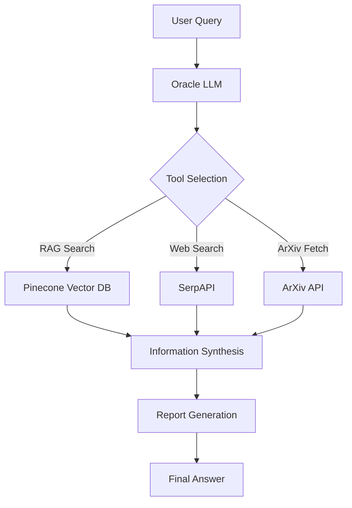

# 🧠 LangGraph: Advanced AI Research Agent

## Table of Contents
- [🌟 Introduction](#introduction)
- [🚀 Features](#features)
- [🛠️ Technologies Used](#technologies-used)
- [📊 Project Structure](#project-structure)
- [🔍 How It Works](#how-it-works)
- [🖥️ Installation](#installation)
- [🎮 Usage](#usage)
- [📚 Skills Learned](#skills-learned)
- [🔬 Future Improvements](#future-improvements)

## 🌟 Introduction

This project demonstrates the implementation of a sophisticated agent system capable of conducting in-depth research on various topics, leveraging multiple data sources, and generating comprehensive reports.

Genius LangGraph showcases the power of LangGraph, a library for building stateful, multi-step applications using language models. By combining LangGraph with tools like RAG (Retrieval Augmented Generation), web search capabilities, and specialized knowledge bases, we've created an AI agent that can navigate complex information landscapes and synthesize findings into coherent, well-structured reports.

## 🚀 Features

- **Multi-source Research**: Utilizes arXiv papers, web search, and custom knowledge bases
- **Intelligent Decision Making**: Employs an "Oracle" LLM for determining optimal research strategies
- **Dynamic Tool Selection**: Chooses appropriate tools based on the research context
- **Comprehensive Report Generation**: Produces well-structured reports with introduction, research steps, main body, conclusion, and sources
- **Stateful Conversations**: Maintains context throughout the research process
- **Visualizable Workflow**: Includes graph visualization of the agent's decision-making process

## 🛠️ Technologies Used

- **LangGraph**: For building the stateful, multi-step AI agent
- **LangChain**: Provides the foundation for working with language models and tools
- **OpenAI GPT Models**: Powers the language understanding and generation capabilities
- **Pinecone**: Vector database for efficient similarity search in the knowledge base
- **SerpAPI**: Enables web search functionality
- **arXiv API**: Allows fetching of scientific paper abstracts
- **Sentence Transformers**: For generating text embeddings
- **Graphviz**: Visualizes the agent's decision-making graph
- **Python Libraries**: requests, re, typing, operator

## 📊 Project Structure



## 🔍 How It Works

1. **Query Input**: The user submits a research query to the system.

2. **Oracle Decision**: The "Oracle" LLM analyzes the query and decides on the best course of action.

3. **Tool Execution**: Based on the Oracle's decision, one of the following tools is executed:
   - RAG Search: Queries the Pinecone vector database for relevant information from indexed arXiv papers.
   - Web Search: Performs a Google search using SerpAPI to gather general knowledge.
   - ArXiv Fetch: Retrieves specific paper abstracts from the arXiv database.

4. **Information Gathering**: The system iteratively collects information using the selected tools.

5. **Synthesis and Report Generation**: Once sufficient information is gathered, the system synthesizes the findings into a structured report.

6. **Final Answer**: The comprehensive report is presented to the user, complete with research steps, main content, conclusion, and sources.

## 🖥️ Installation

1. Clone the repository:
   ```
   git clone https://github.com/yourusername/Genius-LangGraph.git
   cd Genius-LangGraph
   ```

2. Install required packages:
   ```
   pip install -r requirements.txt
   ```

3. Set up environment variables:
   ```
   export OPENAI_API_KEY="your_openai_api_key"
   export PINECONE_API_KEY="your_pinecone_api_key"
   export SERPAPI_API_KEY="your_serpapi_api_key"
   ```

## 🎮 Usage

1. Open the Jupyter notebook:
   ```
   jupyter notebook Genius LangGraph.ipynb
   ```

2. Run the cells to initialize the agent and necessary components.

3. Use the `runnable.invoke()` function to submit queries:
   ```python
   out = runnable.invoke({
       "input": "What are the latest advancements in quantum computing?",
       "chat_history": []
   })
   
   print(build_report(output=out["intermediate_steps"][-1].tool_input))
   ```

## 📚 Skills Learned

- Implementation of stateful AI agents using LangGraph
- Integration of multiple data sources and APIs (arXiv, SerpAPI, Pinecone)
- Advanced prompt engineering for tool selection and report generation
- Vector database operations for similarity search
- Graph-based workflow design and visualization
- Handling of complex, multi-step AI interactions
- Asynchronous programming in AI applications

## 🔬 Future Improvements

- Implement user feedback loop for continuous improvement
- Add support for more specialized knowledge domains
- Enhance the report generation with data visualization capabilities
- Implement caching mechanisms for improved performance
- Develop a user-friendly web interface for easier interaction
